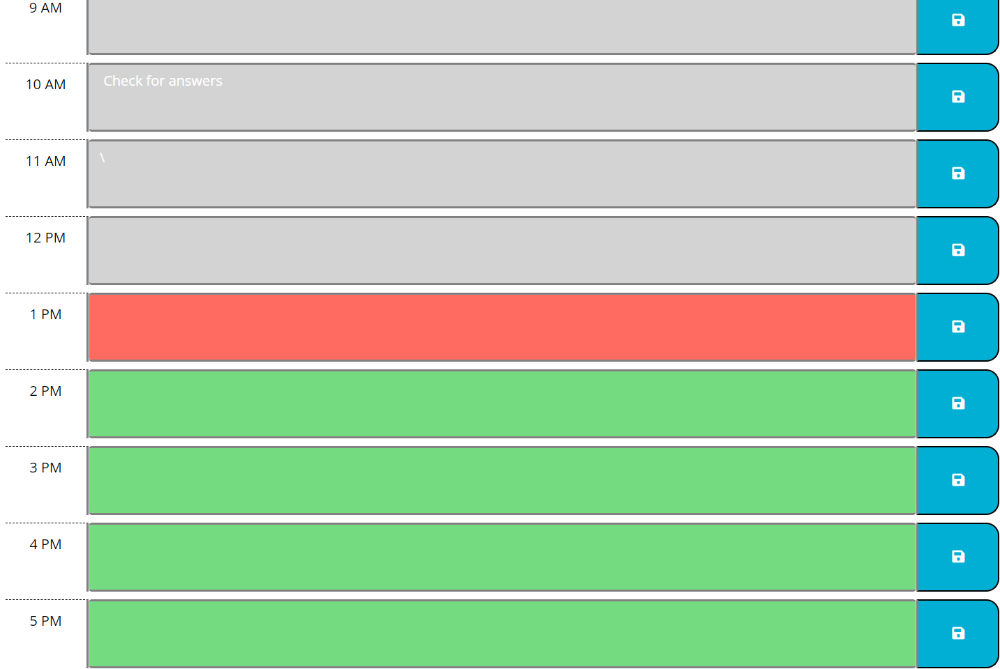
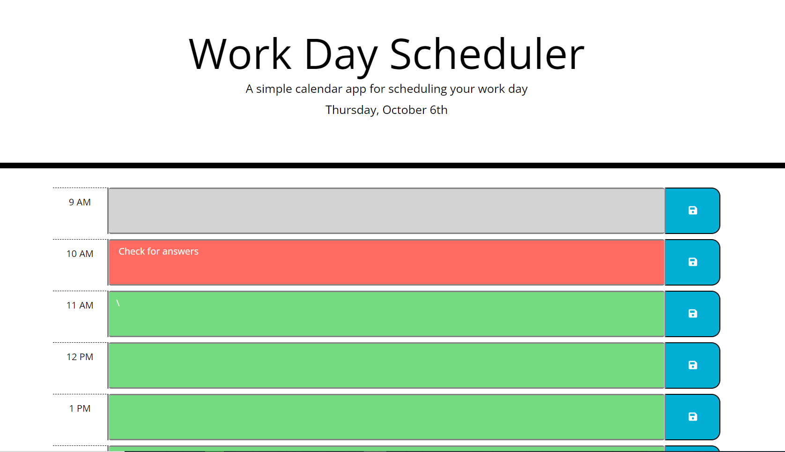

# Work Day Calender
## Description

This web page is spiritual successor to my previous project, the web page.  In it, I created a single work day calender with local storage to remember the tasks the user has in store with local storage.  A simple application but it uses the same techiques I've used on the web quiz.  We use a combination of static and dynamically created HTML element tags and class to style and structure the web page, javascript and jquery to add event listeners to respond to user inputs, using local storage to store and show user input and finally a 3rd party library to pull information from outside the website to set the current style of sections of the website.

First because of the hours in a day remain the same, I can just set it using bootstrap and HTML. The dynamic elements come with a nifty feature that changes the color of the hours rows with the current hour of the day.  I added event listeners to each row using Jquery to save the descriptions of each time row to the local storage, and called the local storage on browser refresh to remind the user of their tasks.  And the final touch is a third-party javascript library called Moment.js.  Moment.js is used to call the current hour and day and dynamically setting the current calender day and time row colors.

All in all, this project was nice because it slowly blended together HTML, CSS and Javascript.  I was setting classes that weren't being used until the Javascript installed them, the HTML was being edited and styled by the user and outside information without showing the main HTML page, and the event listeners were being added by the Javascript by selecting the class rather than static hmtl element.  All in all I had fun.

Take a Look:

https://philiphuang2.github.io/Work-Day-Calendar/

# Screenshots

## Example of the Calender at 1 PM

## Example of the Calender at 10 AM

# Credit

## 3rd Party Libraries

### [Moment.JS](https://momentjs.com/)

A 3rd party Javascript Library that pulls the current time and day.

### [Jquery](https://jquery.com/)

Another 3rd Party Javascript Library that helps with element selection and event listeners

### [Bootstrap](https://getbootstrap.com/)

A HTML and CSS framework that reduced the amount of manual styling and format that I had to do

### [Font Awesome](https://fontawesome.com/)

For my awesome save icon! =)

# License

MIT License

Copyright (c) 2022 Phiip Huang

Permission is hereby granted, free of charge, to any person obtaining a copy
of this software and associated documentation files (the "Software"), to deal
in the Software without restriction, including without limitation the rights
to use, copy, modify, merge, publish, distribute, sublicense, and/or sell
copies of the Software, and to permit persons to whom the Software is
furnished to do so, subject to the following conditions:

The above copyright notice and this permission notice shall be included in all
copies or substantial portions of the Software.

THE SOFTWARE IS PROVIDED "AS IS", WITHOUT WARRANTY OF ANY KIND, EXPRESS OR
IMPLIED, INCLUDING BUT NOT LIMITED TO THE WARRANTIES OF MERCHANTABILITY,
FITNESS FOR A PARTICULAR PURPOSE AND NONINFRINGEMENT. IN NO EVENT SHALL THE
AUTHORS OR COPYRIGHT HOLDERS BE LIABLE FOR ANY CLAIM, DAMAGES OR OTHER
LIABILITY, WHETHER IN AN ACTION OF CONTRACT, TORT OR OTHERWISE, ARISING FROM,
OUT OF OR IN CONNECTION WITH THE SOFTWARE OR THE USE OR OTHER DEALINGS IN THE
SOFTWARE.